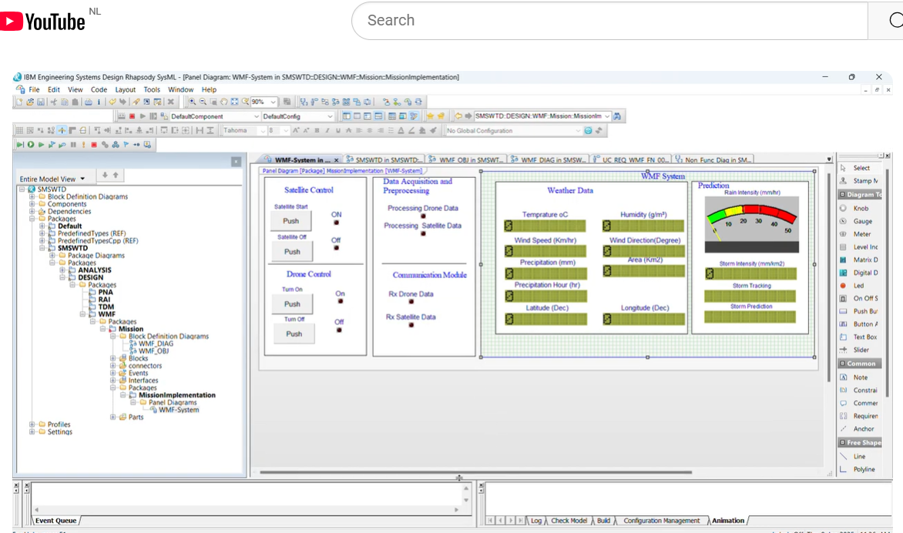

# SMSWTD- Smart Monitoring System for Weather and Tsunami Detection

## Purpose

The SMSWTD project was developed to learn SysML through a class project. It serves as a resource for readers interested in generating code from well-designed SysML models, specifically using C++ and C, while adhering to the MISRA-C++/C standards. Additionally, it incorporates tools such as IBM Rhapsody for model-driven development. Go to the small demo video inside the resources folder to have you an insight about the project.

## 1. System Mission

The mission of SMSWTD is to minimize loss of life and property through cutting-edge solutions for disaster prediction, resilience, and response.

**Objectives:**
- Provide real-time, actionable insights to authorities
- Monitor weather conditions using advanced sensor technologies
- Predict severe weather events and tsunamis with state-of-the-art algorithms
- Mitigate natural disasters by disseminating accurate and timely information

## 2. Vision

To leverage real-time, advanced technologies to save lives during severe weather conditions.

## 3. Values

- **Accuracy:** Ensure precise data flow through processes.
- **Safety:** Prioritize saving lives and protecting property.
- **Collaboration:** Involve all stakeholders for better outcomes.
- **Accessibility:** Facilitate information availability without limitations.
- **Stability:** Maintain consistent and resilient actions in real-time.
- **Flexibility:** Integrate multiple technologies to adapt to new situations.

## 4. Contradictions

- **Accuracy vs. Speed:** Prioritizing accuracy may delay insights, potentially causing panic or misguided decisions.
- **Cost Efficiency vs. Technology:** Budget constraints may hinder the use of advanced technology, affecting prediction accuracy.
- **Predictive Accuracy vs. Public Interpretation:** High predictive accuracy must be complemented by public awareness to avoid misinterpretation of alerts.

## 5. Negative Impact

1. **Inaccurate or Delayed Predictions:** Could lead to overreaction or underreaction in communities.
2. **Data Privacy and Security:** A false sense of security may arise, leading to inadequate preparedness.
3. **Social Inequality:** Vulnerable populations may not receive timely alerts, exacerbating existing inequalities.
4. **Complexity and Inflexibility:** High complexity could slow response times and increase costs.

## 6. System Context and Operating Environment

SMSWTD involves various stakeholders and technological infrastructures. Its success depends on accurate predictions, timely information dissemination, and effective data integration.

**Stakeholders:**
- Government Authorities
- Meteorologists & Scientists

**Operating Environments:**
- Sensor Networks
- Cloud Computing
- Data Communication Systems

## 7. System Requirements

The system requirements are divided into four sections:

1. **Weather Monitoring and Tracking**
   - Storm detection and tracking using satellite imagery and sensors.
   - Real-time updates and centralized dashboards for data visualization.

2. **Tsunami Detection and Monitoring**
3. **Risk Analysis and Integration**
4. **Public Notification and Alert System**

## 8. Tools and programming languages
- IBM Rhapsody 
- C++

## Project Overview

